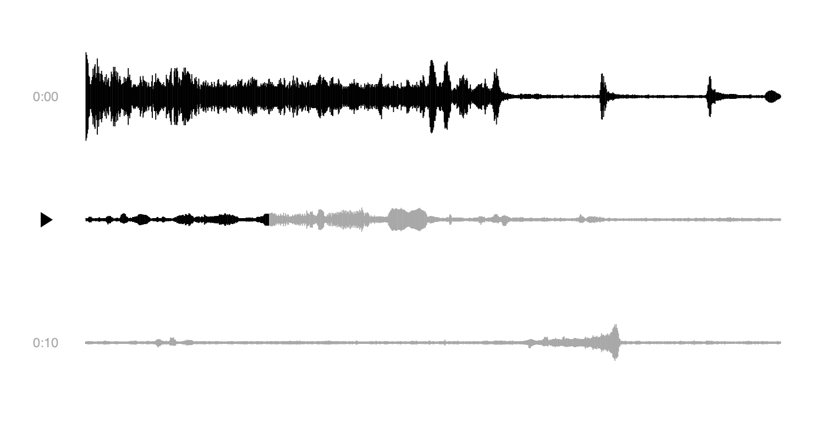

# ▸ wavearea

Multiline waveform player with simple editing.<br/>
Provides minimal ergonomic means to open, edit and save audio pieces.<br/>
Perfect for speech fragments playback / editing.



<!-- [Demo](https://dy.github.io/wavearea?src=https://ia800207.us.archive.org/29/items/MLKDream/MLKDream_64kb.mp3). -->
[Forest sounds](https://dy.github.io/wavearea?src=https://cdn.freesound.org/previews/147/147582_1728127-lq.mp3).

Based on [wavefont](https://github.com/dy/wavefont) and [sprae](https://github.com/dy/sprae).

<!--
## Operations

All operations on audio are reflected in URL as:

```
?src=path/to/audio&clip=300-400&br=100..200..300&del=0-10..10-20&mute=10-20&...
```

Operations are applied to source in turn.
Supported operations are (measured in blocks, each block is 1024 samples wide):

* `src=path/to/audio` – load source file by URL. Can be wav, mp3 or ogg, or any other format supported by browser.
* `norm` – normalize audio - make sure max volume is 1.
* `clip=from-to` – slice audio to indicated range.
* `br=at..at..at...` – break audio by segments at indicated points.
* `del=from-to..from-to..from-to...` – delete fragments of audio.
-->
<!-- * `fadein=start-duration`, `fadeout=start-duration` -->


<p align=center><a href="https://github.com/krishnized/license/">🕉</a></p>
